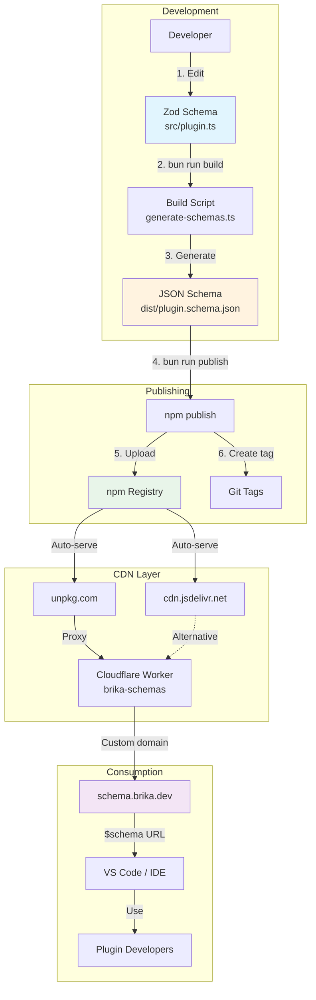

# BRIKA Schema Architecture

Complete architecture diagram and explanation.

## System Overview



## Data Flow

### 1. Development Phase

```
Developer edits Zod schema
    ↓
src/plugin.ts (TypeScript + Zod)
    ↓
bun run build
    ↓
generate-schemas.ts converts via z.toJSONSchema()
    ↓
dist/plugin.schema.json (JSON Schema)
```

**Key Points:**
- Single source of truth (Zod)
- Automatic generation
- Version injected from package.json

### 2. Publishing Phase

```
Developer runs: bun run publish
    ↓
Build script generates JSON Schema
    ↓
npm publish @brika/schema
    ↓
Uploaded to npm registry
    ↓
Git tag created (v0.1.0)
```

**Key Points:**
- One command publishes everything
- Version comes from package.json
- Immutable after publish

### 3. CDN Distribution

```
npm registry
    ↓
    ├─→ unpkg.com (auto-indexes)
    └─→ cdn.jsdelivr.net (auto-indexes)
         ↓
    Cloudflare Worker (proxy)
         ↓
    schema.brika.dev (custom domain)
```

**Key Points:**
- No configuration needed
- Global edge network
- 1-2 minute delay for indexing

### 4. Consumption

```
Plugin developer adds $schema
    ↓
IDE fetches from schema.brika.dev
    ↓
Cloudflare Worker proxies
    ↓
unpkg serves from npm
    ↓
Schema delivered to IDE
    ↓
Real-time validation in editor
```

**Key Points:**
- Automatic IDE integration
- No manual downloads
- Always latest (or pinned version)

## URL Resolution

### Latest Version

```
https://schema.brika.dev/plugin.schema.json
    ↓
Cloudflare Worker
    ↓
https://unpkg.com/@brika/schema/dist/plugin.schema.json
    ↓ (no @version = latest)
npm registry: @brika/schema@latest
    ↓
Returns dist/plugin.schema.json
```

### Specific Version

```
https://schema.brika.dev/0.1.0/plugin.schema.json
    ↓
Cloudflare Worker (parses version)
    ↓
https://unpkg.com/@brika/schema@0.1.0/dist/plugin.schema.json
    ↓
npm registry: @brika/schema@0.1.0
    ↓
Returns dist/plugin.schema.json from that version
```

## Component Responsibilities

### Zod Schema (`src/plugin.ts`)

**Purpose:** Source of truth for validation rules

**Responsibilities:**
- Define validation logic
- Include descriptions
- Set patterns/enums
- Type inference

**Output:** TypeScript types + validation functions

### Build Script (`src/generate-schemas.ts`)

**Purpose:** Convert Zod to JSON Schema

**Responsibilities:**
- Read package.json version
- Call `z.toJSONSchema()`
- Inject custom $id with version
- Write to dist/

**Output:** `dist/plugin.schema.json`

### Publish Script (`scripts/publish.ts`)

**Purpose:** Automate npm publishing

**Responsibilities:**
- Run build
- Check version exists
- Publish to npm
- Show URLs

**Output:** Published npm package

### Cloudflare Worker (`apps/schema-cdn/worker.ts`)

**Purpose:** Custom domain proxy

**Responsibilities:**
- Parse version from URL
- Proxy to unpkg
- Add CORS headers
- Cache responses

**Output:** Schema via custom domain

### npm Registry

**Purpose:** Package hosting

**Responsibilities:**
- Store published packages
- Serve via HTTP
- Version management
- Immutability

**Output:** Package files

### unpkg / jsDelivr

**Purpose:** npm CDN

**Responsibilities:**
- Auto-index npm packages
- Serve files globally
- Handle versions/tags
- Edge caching

**Output:** Fast global access

## Caching Strategy

### Layer 1: npm Registry
- **Cache:** Permanent
- **Invalidation:** Never (immutable)

### Layer 2: unpkg/jsDelivr
- **Cache:** Aggressive (30 days+)
- **Invalidation:** Automatic on new publish

### Layer 3: Cloudflare Worker
- **Cache:** 1 hour (`max-age=3600`)
- **Invalidation:** Automatic after TTL

### Layer 4: IDE
- **Cache:** Until reload
- **Invalidation:** Manual (reload window)

## Failure Modes

### npm Registry Down

```
schema.brika.dev
    ↓
Cloudflare Worker
    ↓
unpkg (failed)
    ↓ (fallback to jsdelivr possible)
cdn.jsdelivr.net
    ↓
Success (alternative CDN)
```

**Mitigation:** Could add fallback in worker

### Cloudflare Worker Down

```
Direct access still works:
- https://unpkg.com/@brika/schema/dist/plugin.schema.json
- https://cdn.jsdelivr.net/npm/@brika/schema/dist/plugin.schema.json
```

**Mitigation:** Document fallback URLs

### CDN Down (unlikely)

```
Browser/IDE has cached copy
    ↓
Continue working with cached version
```

**Mitigation:** IDE caching + DNS failover

## Performance Characteristics

| Metric | Value | Notes |
|--------|-------|-------|
| **First fetch** | ~200-500ms | Global CDN |
| **Cached fetch** | ~50-100ms | Edge cache |
| **Publish → Available** | 1-2 minutes | unpkg indexing |
| **Version update** | Instant | New URL |
| **Uptime** | 99.99% | Cloudflare + npm SLA |

## Security

### Content Integrity

- ✅ npm packages are immutable after publish
- ✅ Versions can't be changed (only deprecated)
- ✅ Git tags provide audit trail

### CORS

```javascript
newResponse.headers.set('Access-Control-Allow-Origin', '*');
```

Allows browser access from any origin.

### HTTPS

- ✅ All URLs are HTTPS
- ✅ Cloudflare provides SSL
- ✅ npm/CDN enforce HTTPS

## Cost Breakdown

| Service | Tier | Cost | Limit |
|---------|------|------|-------|
| **npm** | Free | $0 | Unlimited packages |
| **Cloudflare Worker** | Free | $0 | 100k req/day |
| **unpkg** | Free | $0 | Unlimited |
| **jsDelivr** | Free | $0 | Unlimited |
| **DNS** | Free | $0 | Included with domain |
| **Total** | - | **$0/month** | More than sufficient |

## Scaling

### Current Capacity

- **100,000 requests/day** (Cloudflare free tier)
- Sufficient for **thousands of developers**

### If Exceeded

1. **Cloudflare Workers Paid:** $5/month for 10M requests/day
2. **Direct CDN access:** Bypass worker, use unpkg directly
3. **Multiple workers:** Load balance across workers

**Realistic usage:** < 1,000 requests/day (mostly IDE validation)

## Monitoring

### npm Stats

```bash
npm view @brika/schema
```

Shows: downloads, versions, last publish

### Cloudflare Analytics

Dashboard → Workers → Metrics:
- Request count
- Error rate
- Latency (p50, p95, p99)

### Custom Monitoring

Add to worker for detailed logging:

```javascript
// In worker.js
console.log({
  url: request.url,
  version: version,
  timestamp: Date.now()
});
```

View in: Workers → Logs (Real-time tail)

---

## Architecture Benefits

✅ **Simple** - Few moving parts  
✅ **Reliable** - Multiple fallbacks  
✅ **Fast** - Global CDN  
✅ **Free** - Zero ongoing cost  
✅ **Automatic** - No manual steps  
✅ **Versioned** - Full version history  
✅ **Scalable** - Handles high traffic  

## Related Documentation

- [INFRASTRUCTURE_SETUP.md](./INFRASTRUCTURE_SETUP.md) - Setup guide
- [QUICK_SETUP.md](./QUICK_SETUP.md) - Fast setup
- [packages/schema/README.md](./packages/schema/README.md) - Package docs
- [apps/schema-cdn/README.md](./apps/schema-cdn/README.md) - Worker details

