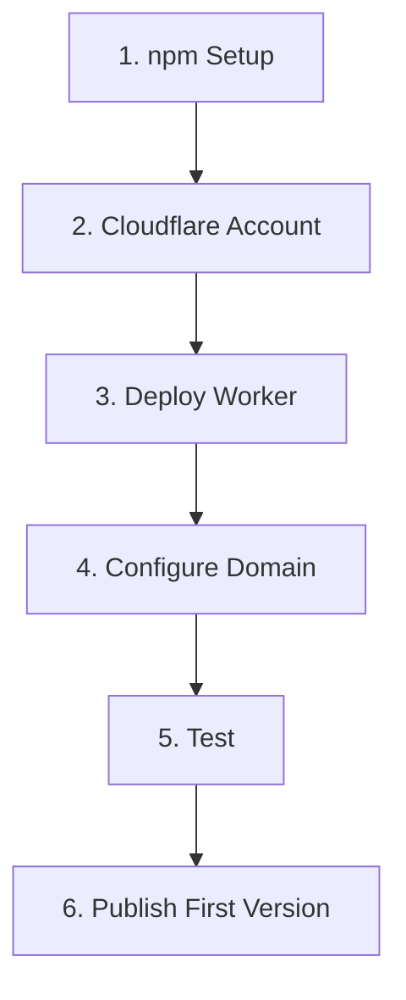

# Infrastructure Setup Guide

Complete guide to set up the BRIKA schema publishing infrastructure.

## Overview



## Prerequisites

- [ ] npm account
- [ ] Cloudflare account (free tier)
- [ ] Domain `brika.dev` (or your domain)
- [ ] Git repository access

---

## Step 1: npm Setup

### 1.1 Create npm Account

If you don't have one:

1. Go to [https://www.npmjs.com/signup](https://www.npmjs.com/signup)
2. Create account
3. Verify email

### 1.2 Login Locally

```bash
npm login
```

Enter your credentials when prompted.

### 1.3 Create/Join @brika Organization

**Option A: Create Organization**

1. Go to [https://www.npmjs.com/org/create](https://www.npmjs.com/org/create)
2. Name: `brika`
3. Type: Public (free)

**Option B: Request Access**

If organization exists, ask the owner to add you:

```bash
npm owner add YOUR_USERNAME @brika/schema
```

### 1.4 Verify Access

```bash
npm whoami
# Should show your username

npm access list packages @brika
# Should show packages you have access to
```

---

## Step 2: Cloudflare Account Setup

### 2.1 Create Account

1. Go to [https://dash.cloudflare.com/sign-up](https://dash.cloudflare.com/sign-up)
2. Create free account
3. Verify email

### 2.2 Add Domain (if not already)

**Option A: Transfer Nameservers (Recommended)**

1. Go to **Websites** → **Add a Site**
2. Enter: `brika.dev`
3. Choose **Free** plan
4. Cloudflare provides nameservers (e.g., `ns1.cloudflare.com`)
5. Update nameservers at your domain registrar
6. Wait for DNS propagation (5min - 48hrs)

**Option B: DNS Only**

If you can't change nameservers, you'll manually add DNS records later.

---

## Step 3: Deploy Cloudflare Worker

### 3.1 Navigate to Workers

1. Go to [Cloudflare Dashboard](https://dash.cloudflare.com/)
2. Click **Workers & Pages** (left sidebar)
3. Click **Create Application**
4. Click **Create Worker**

### 3.2 Create Worker

1. **Name**: `brika-schemas`
2. Click **Deploy**
3. Click **Edit Code**

### 3.3 Add Worker Code

Copy the code from `.cloudflare/worker.js`:

```javascript
const NPM_PACKAGE = '@brika/schema';
const SCHEMAS_PATH = '/dist';

export default {
  async fetch(request) {
    const url = new URL(request.url);
    let path = url.pathname;
    
    // Handle /latest redirect to main branch (for backward compatibility)
    if (path.startsWith('/latest/')) {
      path = path.replace('/latest/', '/');
    } else if (path === '/latest') {
      return Response.redirect(`${url.origin}/`, 302);
    }
    
    // Parse version from path (e.g., /0.1.0/plugin.schema.json)
    const versionMatch = path.match(/^\/(\d+\.\d+\.\d+)\//);
    let version, filePath;
    
    if (versionMatch) {
      // Versioned request: /0.1.0/plugin.schema.json
      version = `@${versionMatch[1]}`;
      filePath = path.replace(/^\/\d+\.\d+\.\d+/, '');
    } else {
      // No version specified: /plugin.schema.json -> use latest
      version = ''; // unpkg/jsdelivr serve latest by default
      filePath = path;
    }
    
    // Build unpkg URL (serves from npm)
    // Alternative: cdn.jsdelivr.net/npm/@brika/schema@version/dist/plugin.schema.json
    const npmUrl = `https://unpkg.com/${NPM_PACKAGE}${version}${SCHEMAS_PATH}${filePath}`;
    
    // Fetch from unpkg (npm CDN)
    const response = await fetch(npmUrl);
    
    // Return 404 if not found
    if (!response.ok) {
      return new Response('Schema not found', { status: 404 });
    }
    
    // Clone response to add custom headers
    const newResponse = new Response(response.body, response);
    newResponse.headers.set('Access-Control-Allow-Origin', '*');
    newResponse.headers.set('Cache-Control', 'public, max-age=3600');
    newResponse.headers.set('X-Served-By', 'Cloudflare + unpkg (npm)');
    
    return newResponse;
  }
}
```

4. Click **Save and Deploy**

### 3.4 Test Worker

Your worker is now live at: `https://brika-schemas.YOUR_ACCOUNT.workers.dev`

Test it (will fail until you publish to npm):

```bash
curl https://brika-schemas.YOUR_ACCOUNT.workers.dev/plugin.schema.json
# Should return 404 (package not published yet)
```

---

## Step 4: Configure Custom Domain

### 4.1 Add Custom Domain to Worker

1. In Worker page, go to **Settings** → **Triggers**
2. Click **Add Custom Domain**
3. Enter: `schema.brika.dev`
4. Click **Add Custom Domain**

### 4.2 DNS Configuration

**If domain is on Cloudflare (recommended):**

DNS records are automatically created! ✅

**If domain is NOT on Cloudflare:**

Manually add DNS record at your registrar:

```
Type: CNAME
Name: schema
Value: brika-schemas.YOUR_ACCOUNT.workers.dev
TTL: Auto or 3600
```

### 4.3 Verify DNS

Wait a few minutes, then test:

```bash
# Check DNS resolution
nslookup schema.brika.dev

# Test endpoint (will 404 until npm publish)
curl -I https://schema.brika.dev/plugin.schema.json
```

Should show Cloudflare IP address.

---

## Step 5: Publish First Version

### 5.1 Build the Schema

```bash
cd packages/schema
bun run build
```

Verify `dist/plugin.schema.json` was created.

### 5.2 Publish to npm

```bash
# Dry run first (see what would be published)
bun run publish --dry-run

# Real publish
bun run publish
```

Output should show:

```
✅ Published successfully!

🌐 Schema available at:
   https://unpkg.com/@brika/schema@0.1.0/dist/plugin.schema.json
   https://cdn.jsdelivr.net/npm/@brika/schema@0.1.0/dist/plugin.schema.json
   https://schema.brika.dev/0.1.0/plugin.schema.json
   https://schema.brika.dev/plugin.schema.json (latest)
```

### 5.3 Push Git Tags

```bash
git push --follow-tags
```

---

## Step 6: Testing

### 6.1 Test Direct npm CDN

```bash
# unpkg
curl https://unpkg.com/@brika/schema@0.1.0/dist/plugin.schema.json

# jsDelivr
curl https://cdn.jsdelivr.net/npm/@brika/schema@0.1.0/dist/plugin.schema.json
```

Both should return the JSON schema.

### 6.2 Test Custom Domain

```bash
# Latest version
curl https://schema.brika.dev/plugin.schema.json

# Specific version
curl https://schema.brika.dev/0.1.0/plugin.schema.json
```

Should return the same schema via your custom domain.

### 6.3 Test in IDE

Update a plugin's `package.json`:

```json
{
  "$schema": "https://schema.brika.dev/plugin.schema.json",
  "name": "@brika/plugin-timer"
}
```

Open in VS Code:
- Should see no errors
- Try adding invalid field → should show error
- Autocomplete should work

---

## Troubleshooting

### npm Publish Issues

#### "need auth"

```bash
npm login
# Login again
```

#### "403 Forbidden"

You don't have permissions to @brika org.

**Solution:** Create your own scope for testing:

```bash
# Change package name
vim packages/schema/package.json
# Change "@brika/schema" to "@YOUR_USERNAME/schema"

# Publish
bun run publish
```

#### "EPUBLISHCONFLICT"

Version already published.

**Solutions:**
```bash
# Option 1: Bump version
npm version patch

# Option 2: Force republish (dev only)
bun run publish --force

# Option 3: Unpublish first
npm unpublish @brika/schema@0.1.0
```

### Cloudflare Worker Issues

#### "Schema not found" (404)

**Possible causes:**

1. **Package not published**
   ```bash
   npm view @brika/schema
   # Check if package exists
   ```

2. **Wrong package name in worker**
   - Check `NPM_PACKAGE` constant in worker.js
   - Should match your package name

3. **CDN caching**
   - Wait 1-2 minutes for unpkg to index
   - Try: `https://unpkg.com/@brika/schema@0.1.0/dist/plugin.schema.json`

#### Custom Domain Not Working

**Check DNS:**

```bash
nslookup schema.brika.dev
# Should show Cloudflare IPs (e.g., 104.xx.xx.xx)
```

**If not resolving:**

1. Verify CNAME record exists
2. Wait for DNS propagation (up to 48hrs)
3. Try different DNS server: `nslookup schema.brika.dev 8.8.8.8`

**If resolving but 404:**

1. Check worker code is deployed
2. Test worker URL directly: `https://brika-schemas.YOUR_ACCOUNT.workers.dev/plugin.schema.json`
3. Check Cloudflare logs: Workers → Logs

### IDE Not Validating

#### Schema Not Loading

**Check URL accessibility:**

```bash
curl -I https://schema.brika.dev/plugin.schema.json
# Should return 200 OK
```

**Clear IDE cache:**

VS Code:
1. Cmd/Ctrl + Shift + P
2. "Developer: Reload Window"

#### Wrong Validation

**Check $schema URL:**

```json
{
  "$schema": "https://schema.brika.dev/plugin.schema.json"
  // ✅ Correct

  "$schema": "https://schema.brika.dev/0.1.0/package.json"
  // ❌ Wrong path
}
```

---

## Monitoring

### Check npm Stats

```bash
# View package info
npm view @brika/schema

# See all versions
npm view @brika/schema versions

# Download stats
npm view @brika/schema
```

### Cloudflare Analytics

1. Go to Worker → **Metrics**
2. View:
   - Request count
   - Errors
   - Latency

### Test URLs Regularly

```bash
# Create test script
cat > test-urls.sh << 'EOF'
#!/bin/bash
echo "Testing schema URLs..."

URLs=(
  "https://unpkg.com/@brika/schema/dist/plugin.schema.json"
  "https://cdn.jsdelivr.net/npm/@brika/schema/dist/plugin.schema.json"
  "https://schema.brika.dev/plugin.schema.json"
)

for url in "${URLs[@]}"; do
  STATUS=$(curl -s -o /dev/null -w "%{http_code}" "$url")
  if [ $STATUS -eq 200 ]; then
    echo "✅ $url"
  else
    echo "❌ $url (HTTP $STATUS)"
  fi
done
EOF

chmod +x test-urls.sh
./test-urls.sh
```

---

## Maintenance

### Publishing Updates

```bash
cd packages/schema

# 1. Edit schema
vim src/plugin.ts

# 2. Bump version
npm version patch  # or minor/major

# 3. Publish
bun run publish

# 4. Push
git push --follow-tags
```

### Rollback

If you publish a bad version:

```bash
# Deprecate (preferred)
npm deprecate @brika/schema@0.1.1 "Use 0.1.2 instead"

# Unpublish (within 72hrs only)
npm unpublish @brika/schema@0.1.1

# Publish fix
npm version patch
bun run publish
```

---

## Checklist

Use this checklist for setup:

**npm:**
- [ ] npm account created
- [ ] Logged in locally (`npm login`)
- [ ] Access to @brika org (or created own scope)

**Cloudflare:**
- [ ] Account created
- [ ] Domain added (nameservers or DNS record)
- [ ] Worker created and deployed
- [ ] Custom domain added to worker

**First Publish:**
- [ ] Schema built (`bun run build`)
- [ ] Dry run tested (`bun run publish --dry-run`)
- [ ] Published successfully (`bun run publish`)
- [ ] Git tags pushed (`git push --follow-tags`)

**Testing:**
- [ ] npm CDN accessible (unpkg/jsdelivr)
- [ ] Custom domain works (schema.brika.dev)
- [ ] IDE validation works
- [ ] No console errors

---

## Next Steps

After setup is complete:

1. **Update all plugins** to use new schema URL
2. **Document** schema URL in project README
3. **Share** with external plugin developers
4. **Monitor** usage via npm stats and Cloudflare analytics

## Support

If you encounter issues:

1. Check this guide's Troubleshooting section
2. Review `.cloudflare/README.md` for worker details
3. Check `packages/schema/PUBLISHING.md` for npm details
4. Test with `curl -v` for detailed error info

---

**Setup Time:** ~20-30 minutes  
**One-time cost:** $0  
**Ongoing cost:** $0  

🎉 Once set up, everything is automatic!

