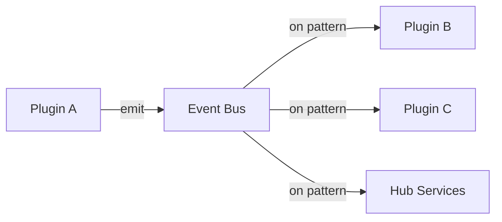

# Event System

Complete reference for the event system in the `@brika/sdk` package.

## Overview

The event system enables pub/sub communication between plugins and the hub. Events are the primary way for plugins to communicate and react to system state changes.

```typescript
import { emit, on, onEvent } from "@brika/sdk";
```

---

## Core Concepts

### Event Flow



### Event Structure

Every event has this structure:

```typescript
interface EventPayload {
  id: string;       // Unique event ID (UUID)
  type: string;     // Event type (e.g., "device.updated")
  source: string;   // Source plugin ID
  payload: Json;    // Event data
  ts: number;       // Timestamp (Unix ms)
}
```

---

## Functions

### emit

Emit an event to the hub event bus.

```typescript
function emit(eventType: string, payload?: Json): void
```

**Parameters:**

| Parameter | Type | Description |
|-----------|------|-------------|
| `eventType` | `string` | Event type (dot-notation recommended) |
| `payload` | `Json` | Event data (optional) |

**Examples:**

```typescript
import { emit, log } from "@brika/sdk";

// Simple event
emit("timer.started");

// Event with payload
emit("timer.completed", {
  id: "abc123",
  name: "Morning Alarm",
  duration: 28800000,
});

// Device event
emit("device.state_changed", {
  deviceId: "light-1",
  property: "brightness",
  oldValue: 50,
  newValue: 100,
});

// Error event
emit("plugin.error", {
  message: "Connection failed",
  code: "ECONNREFUSED",
});
```

---

### on

Subscribe to events matching a glob pattern. Returns an unsubscribe function.

```typescript
function on(pattern: string, handler: EventHandler): () => void
```

**Parameters:**

| Parameter | Type | Description |
|-----------|------|-------------|
| `pattern` | `string` | Glob pattern to match event types |
| `handler` | `EventHandler` | Function called for each matching event |

**Returns:** Unsubscribe function

**EventHandler:**

```typescript
type EventHandler = (event: EventPayload) => void | Promise<void>;
```

**Examples:**

```typescript
import { on, log } from "@brika/sdk";

// Exact match
const unsub = on("timer.completed", (event) => {
  log.info("Timer completed", { 
    timerId: event.payload.id 
  });
});

// Wildcard match
on("device.*", (event) => {
  log.info(`Device event: ${event.type}`, { 
    payload: event.payload 
  });
});

// All events
on("**", (event) => {
  log.debug("Event received", { 
    type: event.type, 
    source: event.source 
  });
});

// Async handler
on("motion.detected", async (event) => {
  await notifyUser(event.payload.zone);
});
```

---

### onEvent

Alias for `on`. Both functions are identical.

```typescript
const onEvent = on;
```

---

## Pattern Matching

Events use glob patterns for flexible matching:

| Pattern | Matches | Does Not Match |
|---------|---------|----------------|
| `device.updated` | `device.updated` | `device.created`, `device` |
| `device.*` | `device.updated`, `device.created` | `device.state.changed` |
| `device.**` | `device.updated`, `device.state.changed` | `motion.detected` |
| `*.updated` | `device.updated`, `user.updated` | `device.created` |
| `**` | All events | — |

### Pattern Rules

- `*` matches one segment
- `**` matches any number of segments
- Patterns are case-sensitive
- Segments are separated by `.`

---

## Event Naming Conventions

### Recommended Structure

```
{domain}.{action}
{domain}.{subdomain}.{action}
```

### Common Patterns

| Event Type | Use Case |
|------------|----------|
| `device.updated` | Device state changed |
| `device.{id}.updated` | Specific device changed |
| `timer.started` | Timer began |
| `timer.completed` | Timer finished |
| `automation.triggered` | Automation executed |
| `plugin.error` | Plugin error occurred |
| `system.startup` | Hub started |
| `system.shutdown` | Hub stopping |

### Standard Events

These events are emitted by the hub:

| Event | Payload | Description |
|-------|---------|-------------|
| `system.startup` | `{}` | Hub has started |
| `system.shutdown` | `{}` | Hub is stopping |
| `plugin.loaded` | `{ pluginId }` | Plugin was loaded |
| `plugin.stopped` | `{ pluginId }` | Plugin was stopped |

---

## Usage Patterns

### React to Device Changes

```typescript
import { on, emit, log } from "@brika/sdk";

on("device.*.brightness", (event) => {
  const { deviceId, value } = event.payload;
  
  if (value > 80) {
    log.info("Bright light detected", { deviceId });
    emit("scene.bright_mode", { trigger: deviceId });
  }
});
```

### Cross-Plugin Communication

**Plugin A (Sensor):**

```typescript
import { emit, onInit } from "@brika/sdk";

onInit(() => {
  // Emit motion events
  motionSensor.on("motion", (zone) => {
    emit("motion.detected", { zone, ts: Date.now() });
  });
});
```

**Plugin B (Lights):**

```typescript
import { on, log } from "@brika/sdk";

on("motion.detected", async (event) => {
  const { zone } = event.payload;
  log.info("Motion in zone", { zone });
  await turnOnLights(zone);
});
```

### Event Aggregation

```typescript
import { on } from "@brika/sdk";

const recentEvents: EventPayload[] = [];

on("sensor.*", (event) => {
  recentEvents.push(event);
  
  // Keep last 100 events
  if (recentEvents.length > 100) {
    recentEvents.shift();
  }
});
```

### Conditional Subscription

```typescript
import { on, onInit, onStop, log } from "@brika/sdk";

let unsubscribe: (() => void) | null = null;

onInit(() => {
  // Subscribe only during active hours
  const hour = new Date().getHours();
  if (hour >= 8 && hour < 22) {
    unsubscribe = on("motion.*", handleMotion);
    log.info("Motion monitoring enabled");
  }
});

onStop(() => {
  unsubscribe?.();
});
```

---

## Best Practices

### 1. Use Namespaced Events

```typescript
// Good - clear namespace
emit("myPlugin.sensor.reading", { value: 42 });

// Avoid - too generic
emit("reading", { value: 42 });
```

### 2. Include Timestamps

```typescript
emit("device.updated", {
  deviceId: "light-1",
  value: 100,
  ts: Date.now(),  // Include timestamp
});
```

### 3. Clean Up Subscriptions

```typescript
import { on, onStop, log } from "@brika/sdk";

const unsubscribe = on("device.*", handleDevice);

onStop(() => {
  unsubscribe();
  log.info("Cleaned up subscriptions");
});
```

### 4. Handle Errors in Handlers

```typescript
on("device.updated", async (event) => {
  try {
    await processDevice(event.payload);
  } catch (err) {
    log.error("Failed to process device event", { 
      error: err,
      event: event.type 
    });
  }
});
```

### 5. Keep Payloads Serializable

```typescript
// Good - serializable payload
emit("sensor.reading", {
  value: 42,
  unit: "celsius",
  ts: Date.now(),
});

// Bad - non-serializable
emit("sensor.reading", {
  value: 42,
  callback: () => {},  // Functions not allowed
  date: new Date(),    // Use timestamp instead
});
```

---

## TypeScript Support

### Typed Event Handlers

```typescript
interface MotionEvent {
  zone: string;
  confidence: number;
  ts: number;
}

on("motion.detected", (event) => {
  const payload = event.payload as MotionEvent;
  if (payload.confidence > 0.8) {
    handleMotion(payload.zone);
  }
});
```

### Event Factory Pattern

```typescript
function createMotionEvent(zone: string, confidence: number) {
  return {
    zone,
    confidence,
    ts: Date.now(),
  };
}

emit("motion.detected", createMotionEvent("living-room", 0.95));
```
