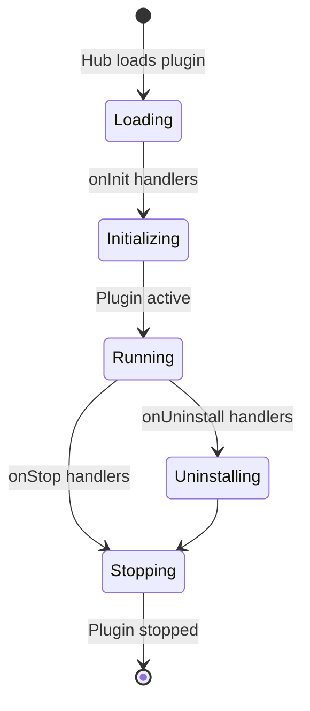
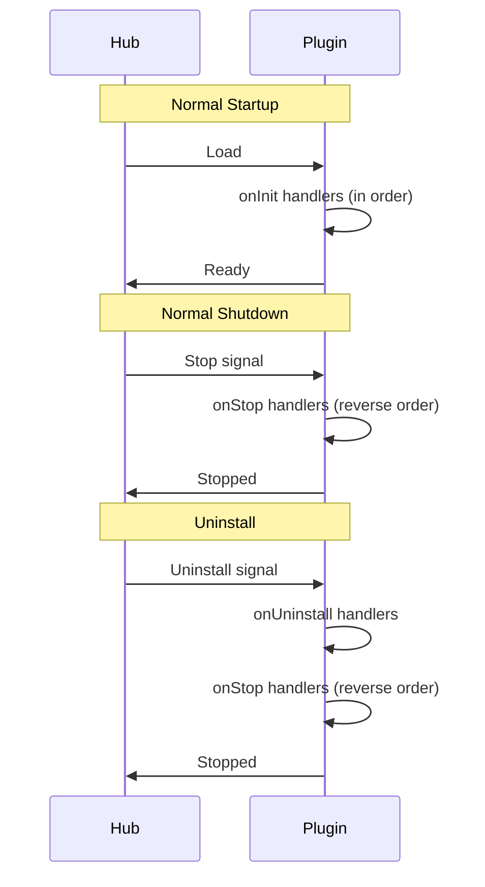

# Lifecycle API

Complete reference for plugin lifecycle hooks in the `@brika/sdk` package.

## Overview

Lifecycle hooks let plugins respond to initialization, shutdown, and uninstallation events.

```typescript
import { onInit, onStop, onUninstall, log } from "@brika/sdk";
```

---

## Lifecycle Phases



---

## Functions

### onInit

Register a handler that runs when the plugin initializes.

```typescript
function onInit(handler: () => void | Promise<void>): () => void
```

**Parameters:**

| Parameter | Type | Description |
|-----------|------|-------------|
| `handler` | `InitHandler` | Function to run on initialization |

**Returns:** Unregister function

**Behavior:**
- Runs after plugin is loaded but before it's considered "ready"
- If the plugin is already initialized, runs immediately
- Async handlers are awaited before continuing
- Multiple `onInit` handlers run in registration order

**Examples:**

```typescript
import { onInit, log } from "@brika/sdk";

// Basic initialization
onInit(() => {
  log.info("Plugin initialized");
});

// Async initialization
onInit(async () => {
  log.info("Connecting to database...");
  await database.connect();
  log.info("Database connected");
});

// Conditional registration
const unregister = onInit(() => {
  // This runs only if not unregistered
  setupFeature();
});

// Later, if needed:
unregister();
```

---

### onStop

Register a cleanup handler that runs when the plugin stops.

```typescript
function onStop(handler: () => void | Promise<void>): () => void
```

**Parameters:**

| Parameter | Type | Description |
|-----------|------|-------------|
| `handler` | `StopHandler` | Function to run on shutdown |

**Returns:** Unregister function

**Behavior:**
- Runs when plugin receives stop signal
- Async handlers are awaited
- Multiple `onStop` handlers run in **reverse** registration order (LIFO)
- Should complete cleanup within a reasonable time

**Examples:**

```typescript
import { onStop, log } from "@brika/sdk";

// Basic cleanup
onStop(() => {
  log.info("Plugin stopping");
});

// Close connections
onStop(async () => {
  log.info("Closing database connection...");
  await database.close();
  log.info("Database closed");
});

// Cancel timers
let intervalId: Timer | null = null;

onInit(() => {
  intervalId = setInterval(poll, 5000);
});

onStop(() => {
  if (intervalId) {
    clearInterval(intervalId);
    log.info("Polling stopped");
  }
});
```

---

### onUninstall

Register a handler for permanent cleanup when the plugin is uninstalled.

```typescript
function onUninstall(handler: () => void | Promise<void>): () => void
```

**Parameters:**

| Parameter | Type | Description |
|-----------|------|-------------|
| `handler` | `UninstallHandler` | Function to run on uninstall |

**Returns:** Unregister function

**Behavior:**
- Runs **before** `onStop` handlers
- Use for permanent cleanup (delete files, revoke tokens)
- Only runs when plugin is uninstalled, not on restart

**Examples:**

```typescript
import { onUninstall, log } from "@brika/sdk";

// Delete stored data
onUninstall(async () => {
  log.info("Cleaning up plugin data...");
  await fs.rm("./plugin-data", { recursive: true });
  log.info("Plugin data deleted");
});

// Revoke API tokens
onUninstall(async () => {
  log.info("Revoking API tokens...");
  await api.revokeAllTokens();
});
```

---

## Execution Order



---

## Usage Patterns

### Resource Management

```typescript
import { onInit, onStop, log } from "@brika/sdk";

let connection: Connection | null = null;

onInit(async () => {
  log.info("Connecting to service...");
  connection = await Service.connect({
    url: "wss://example.com",
    retries: 3,
  });
  log.info("Connected to service");
});

onStop(async () => {
  if (connection) {
    log.info("Closing connection...");
    await connection.close();
    connection = null;
    log.info("Connection closed");
  }
});
```

### Timer Management

```typescript
import { onInit, onStop, log } from "@brika/sdk";

const timers: Timer[] = [];

onInit(() => {
  // Start polling
  timers.push(setInterval(pollSensors, 1000));
  timers.push(setInterval(syncState, 5000));
  log.info("Polling started");
});

onStop(() => {
  timers.forEach(clearInterval);
  timers.length = 0;
  log.info("Polling stopped");
});
```

### Graceful Shutdown

```typescript
import { onStop, log } from "@brika/sdk";

onStop(async () => {
  // Wait for pending operations
  log.info("Waiting for pending operations...");
  await Promise.all(pendingOperations);

  // Final cleanup
  log.info("Cleanup complete");
});
```

### Credential Cleanup

```typescript
import { onUninstall, log } from "@brika/sdk";

onUninstall(async () => {
  log.info("Revoking stored credentials...");
  
  // Remove from keychain
  await keychain.delete("myPlugin.apiKey");
  
  // Revoke OAuth tokens
  const tokens = await storage.get("oauthTokens");
  if (tokens) {
    await oauth.revoke(tokens.refreshToken);
    await storage.delete("oauthTokens");
  }
  
  log.info("Credentials revoked");
});
```

---

## Best Practices

### 1. Always Clean Up Resources

```typescript
// Track all resources
const resources: Disposable[] = [];

onInit(() => {
  resources.push(createWebSocket());
  resources.push(createFileWatcher());
});

onStop(() => {
  resources.forEach((r) => r.dispose());
  resources.length = 0;
});
```

### 2. Handle Errors Gracefully

```typescript
onStop(async () => {
  try {
    await database.close();
  } catch (err) {
    log.error("Failed to close database", { error: err });
    // Don't rethrow - let other cleanup continue
  }
});
```

### 3. Set Timeouts for External Operations

```typescript
onStop(async () => {
  const timeout = 5000;
  
  try {
    await Promise.race([
      externalService.disconnect(),
      new Promise((_, reject) =>
        setTimeout(() => reject(new Error("Timeout")), timeout)
      ),
    ]);
  } catch (err) {
    log.warn("Disconnect timed out, forcing close");
  }
});
```

### 4. Log Lifecycle Events

```typescript
onInit(() => {
  log.info("Plugin initialized", { version: "1.0.0" });
});

onStop(() => {
  log.info("Plugin stopping");
});

onUninstall(() => {
  log.info("Plugin being uninstalled");
});
```

---

## Type Definitions

```typescript
/** Initialization handler */
type InitHandler = () => void | Promise<void>;

/** Stop/cleanup handler */
type StopHandler = () => void | Promise<void>;

/** Uninstall handler */
type UninstallHandler = () => void | Promise<void>;
```
