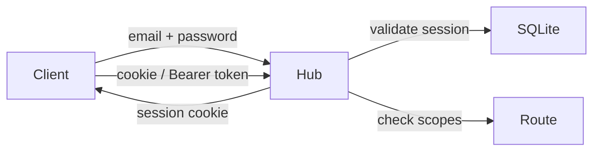

# Authentication

BRIKA ships a built-in authentication system (`@brika/auth`) with session-based auth, role-based access control, and scope-based permissions.

## Overview



Authentication uses **session tokens** stored in an HTTP-only cookie (`brika_session`). API tokens with Bearer auth are also supported for third-party integrations.

## Roles

Every user has a role that determines their default permissions:

| Role | Description | Default Scopes |
|------|-------------|----------------|
| `admin` | Full access | `admin:*` |
| `user` | Standard user | `workflow:*`, `board:*`, `plugin:read`, `settings:read` |
| `guest` | Read-only | `workflow:read`, `board:read`, `plugin:read` |
| `service` | API tokens | Custom (explicitly assigned) |

## Scopes

Scopes are fine-grained permissions attached to each user. `admin:*` implies all scopes.

| Scope | Description |
|-------|-------------|
| `admin:*` | Full administrative access |
| `workflow:read` | Read workflows |
| `workflow:write` | Create and edit workflows |
| `workflow:execute` | Execute workflows |
| `board:read` | Read boards |
| `board:write` | Create and edit boards |
| `plugin:read` | List and read plugins |
| `plugin:manage` | Install and uninstall plugins |
| `settings:read` | Read system settings |
| `settings:write` | Modify system settings |

## Session Lifecycle

1. User sends `POST /api/auth/login` with email and password
2. Hub verifies credentials (bcrypt) and creates a session in SQLite
3. A session token is returned as an HTTP-only cookie
4. Subsequent requests include the cookie automatically
5. The `requireSession` middleware validates the token and attaches the session to the request context
6. `POST /api/auth/logout` revokes the session

Sessions expire after **7 days** by default (configurable).

## Protecting Routes

### Require Authentication

Use `requireAuth()` to block unauthenticated requests (returns 401):

```typescript
import { group, route } from "@brika/router";
import { requireAuth } from "@brika/auth/server";

group("/api/workflows", [requireAuth()], [
  route.get("/", listWorkflows),
  route.post("/", createWorkflow),
]);
```

### Require Specific Scopes

Use `requireScope()` to enforce permissions (returns 403 if missing):

```typescript
import { requireScope } from "@brika/auth/server";
import { Scope } from "@brika/auth";

group("/api/workflows", [requireScope(Scope.WORKFLOW_READ)], [
  route.get("/", listWorkflows),
]);

group("/api/workflows", [requireScope(Scope.WORKFLOW_WRITE)], [
  route.post("/", createWorkflow),
]);
```

### Check Scopes Without Middleware

Use `canAccess()` for conditional logic:

```typescript
import { canAccess } from "@brika/auth";
import { Scope } from "@brika/auth";

if (canAccess(session.scopes, Scope.WORKFLOW_EXECUTE)) {
  // user can execute workflows
}
```

## React Integration

### AuthProvider

Wrap your app with the provider:

```tsx
import { AuthProvider } from "@brika/auth/react";

function App() {
  return (
    <AuthProvider>
      <Router />
    </AuthProvider>
  );
}
```

### Hooks

```tsx
import { useAuth, useCanAccess } from "@brika/auth/react";
import { Scope } from "@brika/auth";

function Dashboard() {
  const { user, logout } = useAuth();
  const canManagePlugins = useCanAccess(Scope.PLUGIN_MANAGE);

  return (
    <div>
      <p>Hello, {user.name}</p>
      {canManagePlugins && <PluginManager />}
      <button onClick={logout}>Logout</button>
    </div>
  );
}
```

### Scope Guards

Protect components with `withScopeGuard()`:

```tsx
import { withScopeGuard } from "@brika/auth/react";
import { Scope } from "@brika/auth";

const AdminPanel = withScopeGuard(
  () => <div>Admin-only content</div>,
  Scope.ADMIN_ALL,
  { fallback: <ForbiddenPage /> }
);
```

### Protected Routes (TanStack Router)

Use `createProtectedRoutes` to declare all routes in one place with automatic scope guards:

```tsx
import { createProtectedRoutes } from "@brika/auth/tanstack";
import { Scope } from "@brika/auth";

const { routes, routeTree } = createProtectedRoutes(rootRoute, {
  workflows: {
    list: { path: "/workflows", scopes: Scope.WORKFLOW_READ, component: WorkflowList },
    edit: { path: "/workflows/$id/edit", scopes: Scope.WORKFLOW_WRITE, component: WorkflowEditor },
  },
  boards: {
    list: { path: "/boards", scopes: Scope.BOARD_READ, component: BoardsLayout },
    detail: { path: "/boards/$boardId", scopes: Scope.BOARD_READ, component: BoardDetail },
  },
}, {
  defaultForbiddenComponent: ForbiddenPage,
});
```

Each route definition is automatically wrapped with `withScopeGuard`. The returned `routes` object provides:

- **`.path`** — the URL pattern (use for parameterless routes): `routes.workflows.list.path`
- **`.to(params)`** — type-safe param resolution: `routes.workflows.edit.to({ id: '123' })`
- **`.scopes`** — the effective scopes for permission checks: `useCanAccess(routes.workflows.edit.scopes)`

## API Tokens

API tokens allow third-party integrations to authenticate with Bearer auth. Each token has an explicit set of scopes.

### Create a Token (CLI)

```bash
bun run auth token create <email>
```

The CLI prompts for a token name and scopes, then prints the plaintext token once. Store it securely — it cannot be retrieved later.

### Use a Token

```bash
curl -H "Authorization: Bearer <token>" http://localhost:3001/api/workflows
```

## CLI Commands

Manage users and tokens from the command line:

```bash
# Users
bun run auth user add        # Create a user (interactive)
bun run auth user list       # List all users
bun run auth user edit       # Edit a user
bun run auth user delete     # Delete a user

# API Tokens
bun run auth token create    # Create an API token
```

## Configuration

Auth settings are passed at bootstrap and can be overridden:

```typescript
auth({
  dataDir: "/path/to/data",
  server,
  config: {
    session: {
      ttl: 604800, // 7 days (seconds)
      cookieName: "brika_session",
    },
    password: {
      minLength: 8,
      requireUppercase: true,
      requireNumbers: true,
      requireSpecial: true,
    },
  },
});
```

## Database

Auth data is stored in a SQLite database (`auth.db`) inside the data directory (`BRIKA_DATA_DIR`). The database uses WAL mode for concurrent reads.

Tables:

| Table | Purpose |
|-------|---------|
| `users` | User accounts, password hashes, roles, scopes |
| `sessions` | Active sessions with token hashes and expiry |
| `api_tokens` | API tokens with scopes, usage tracking, expiry |

## Package Exports

| Import Path | Content |
|-------------|---------|
| `@brika/auth` | Types, roles, scopes, schemas, config |
| `@brika/auth/server` | Services, middleware, routes, DB setup |
| `@brika/auth/client` | Browser HTTP client (`AuthClient`) |
| `@brika/auth/react` | `AuthProvider`, hooks, `withScopeGuard` HOC |
| `@brika/auth/tanstack` | `createProtectedRoutes`, TanStack Router integration |
