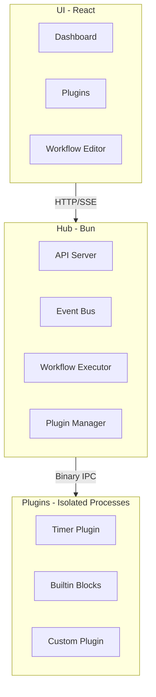
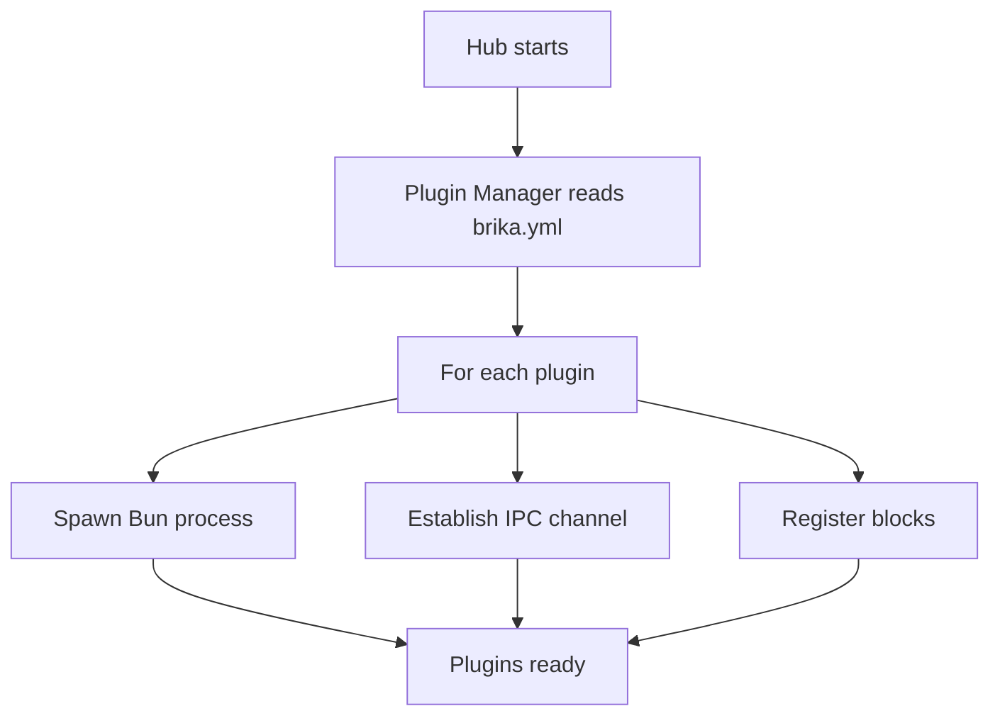
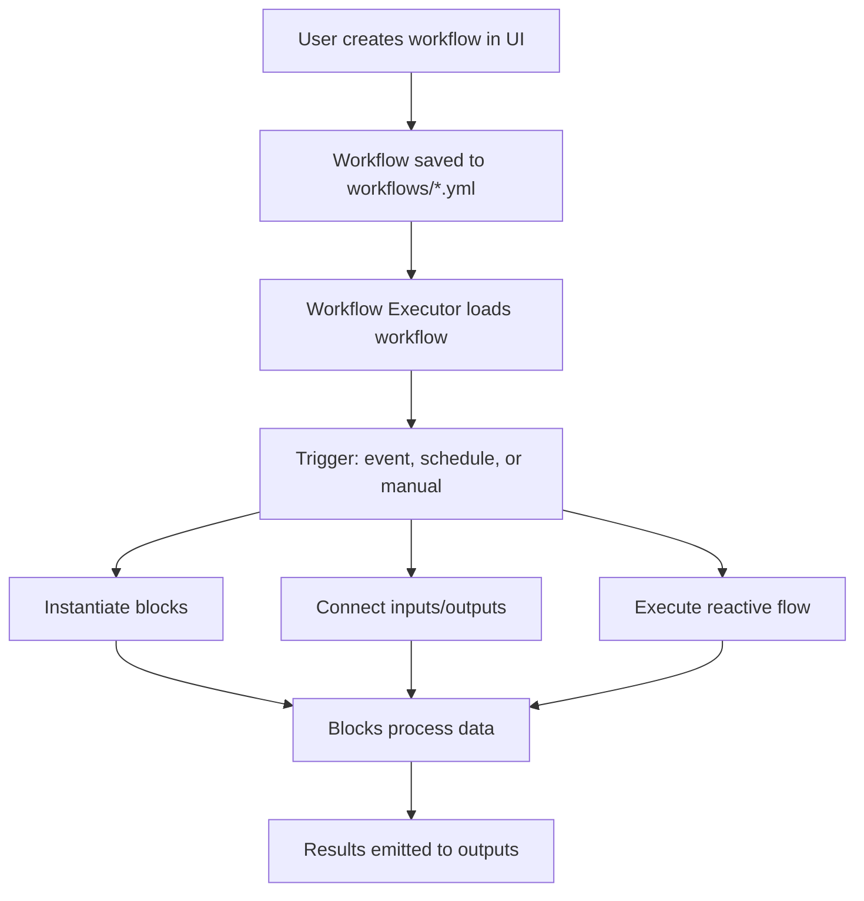
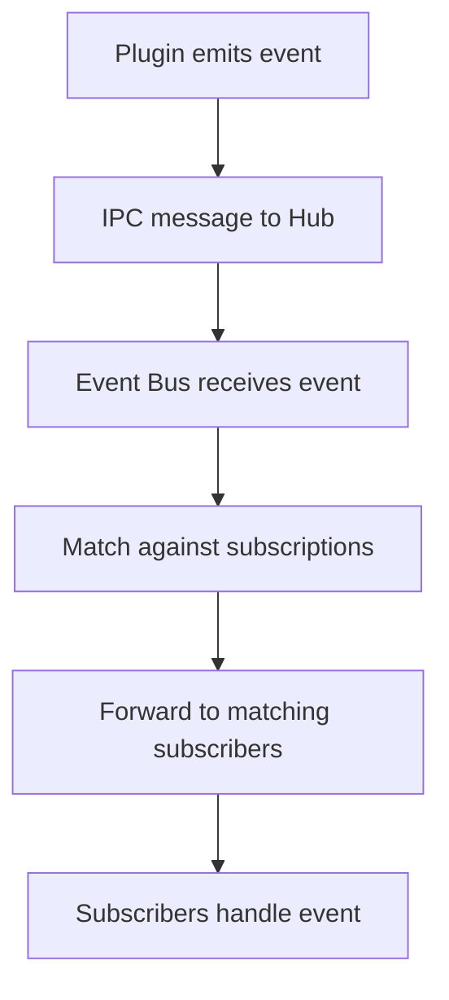
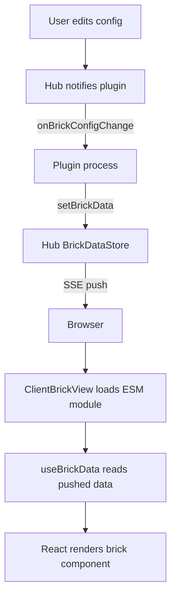

# System Overview

BRIKA is a Bun-first home automation runtime with reactive block-based visual workflows.

## High-Level Architecture



## Core Components

### Hub

The central runtime that orchestrates everything:

* **API Server** — REST API and SSE for real-time updates
* **Event Bus** — Pub/sub messaging with glob patterns
* **Workflow Executor** — Runs block-based automations
* **Plugin Manager** — Loads and manages plugin processes

**Key files:**

* `apps/hub/src/main.ts` — Entry point
* `apps/hub/src/runtime/http/api-server.ts` — API endpoints
* `apps/hub/src/runtime/plugins/plugin-manager.ts` — Plugin loading
* `apps/hub/src/runtime/workflows/workflow-executor.ts` — Workflow execution

### UI

React-based frontend with:

* **Dashboard** — Overview and statistics
* **Plugin Manager** — Browse and configure plugins
* **Workflow Editor** — Visual block-based editor (React Flow)
* **Logs Viewer** — Real-time log streaming

**Key files:**

* `apps/ui/src/main.tsx` — Entry point
* `apps/ui/src/features/` — Feature modules

### Plugins

Isolated processes that provide blocks and bricks:

* Run in separate Bun processes
* Communicate via binary IPC
* Define reactive blocks for workflows
* Provide client-rendered bricks for dashboards
* Access event bus for messaging

**Key files:**

* `packages/sdk/src/index.ts` — SDK exports
* `packages/compiler/src/index.ts` — Build-time compilation
* `plugins/*/src/index.tsx` — Plugin entry points
* `plugins/*/src/bricks/*.tsx` — Client-rendered brick components

## Data Flow

### 1. Plugin Loading



### 2. Workflow Execution



### 3. Event Flow



### 4. Brick Rendering

Bricks are client-rendered — plugin processes push data, and the browser renders React components.



**Build pipeline:**

```mermaid
flowchart LR
    A[src/bricks/*.tsx] -->|Bun.build| B[ESM module]
    B -->|externals plugin| C[Shared deps via globalThis.__brika]
    B -->|actions plugin| D[Action stubs with __actionId]
    C & D --> E[/api/bricks/id/module.js?hash=...]
```

## Communication Protocols

### HTTP API

RESTful API for CRUD operations:

```
GET  /api/plugins        # List plugins
GET  /api/workflows      # List workflows
POST /api/workflows      # Create workflow
GET  /api/health         # Health check
```

### SSE (Server-Sent Events)

Real-time streaming for:

* Log entries
* Plugin status
* Workflow execution events

### Binary IPC

Efficient communication between hub and plugins:

* Message passing (not shared memory)
* Structured binary protocol
* Low latency, high throughput

## Technology Stack

| Layer | Technology |
|-------|------------|
| Runtime | Bun, TypeScript |
| Validation | Zod |
| Frontend | React, Vite, TanStack |
| UI Components | shadcn/ui, Tailwind CSS |
| Workflow Editor | React Flow |
| Brick Compiler | @brika/compiler (Bun.build) |
| IPC | Custom binary protocol |

## Scalability

### Current Design

* Single hub process
* Multiple plugin processes
* In-memory event bus
* File-based workflow storage

### Future Considerations

* Distributed hub (multiple instances)
* Persistent event store
* Database-backed workflows
* Remote plugin execution
