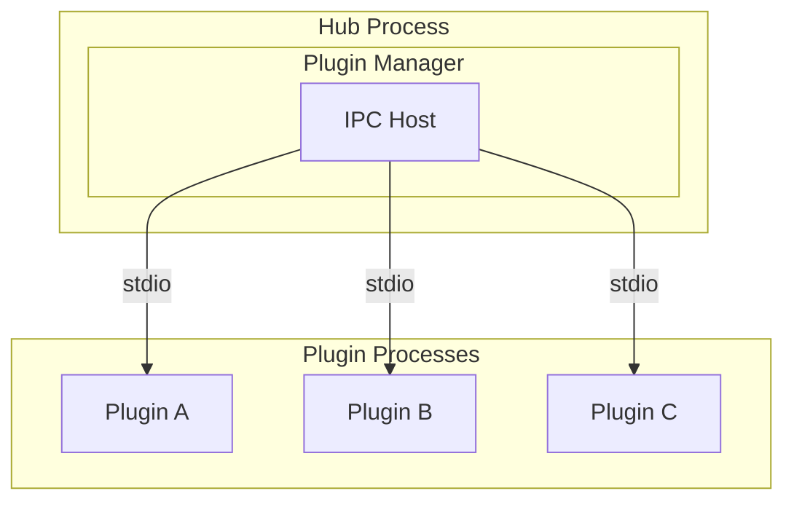
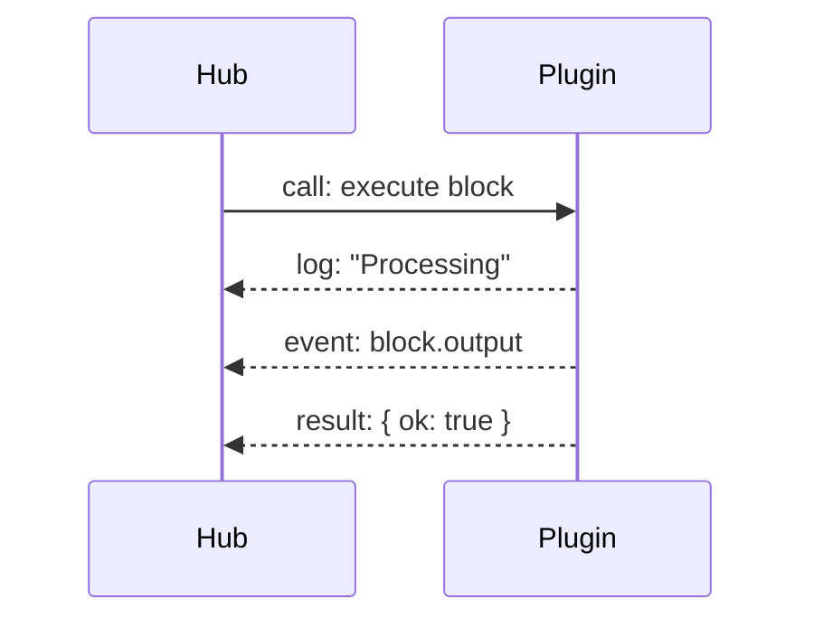

# Plugin Isolation

Each BRIKA plugin runs in an isolated process for security and stability.

## Why Isolation?

### Crash Isolation

If a plugin crashes, it doesn't affect the hub or other plugins:

```
Plugin A crashes → Only Plugin A affected
Hub continues → Other plugins unaffected
Plugin A restarts → Normal operation resumes
```

### Memory Isolation

Plugins cannot access each other's memory:

* No shared state between plugins
* No memory leaks across boundaries
* Each plugin has its own heap

### Security

Plugins are sandboxed:

* Cannot access hub internals
* Cannot modify other plugins
* Limited file system access

## Architecture



## IPC Protocol

### Message Types

| Type | Direction | Description |
|------|-----------|-------------|
| `ready` | Plugin → Hub | Plugin initialized |
| `call` | Hub → Plugin | Invoke a method |
| `result` | Plugin → Hub | Method result |
| `event` | Both | Event notification |
| `log` | Plugin → Hub | Log entry |

### Binary Format

Messages use a binary protocol:


### Communication Flow



## Lifecycle

### Plugin Startup

1. Hub spawns Bun process for plugin
2. Plugin initializes SDK
3. Plugin registers blocks
4. Plugin sends `ready` message
5. Hub marks plugin as active

### Plugin Shutdown

1. Hub sends stop signal
2. Plugin runs `onStop` hooks
3. Plugin cleans up resources
4. Process exits
5. Hub removes plugin

### Crash Recovery

1. Plugin process crashes
2. Hub detects exit
3. Hub logs error
4. Hub attempts restart (with backoff)
5. Plugin reinitializes

## Communication Patterns

### Request-Response

```typescript
// Hub calls plugin method
const result = await plugin.call("executeBlock", {
  blockId: "greet",
  config: { name: "World" },
});
```

### Spark Streaming

```typescript
// Plugin defines and emits a spark
const sensorReading = defineSpark({
  id: "sensor-reading",
  schema: z.object({ temperature: z.number() }),
});

sensorReading.emit({ temperature: 23.5 });

// Hub receives, persists to SQLite, and routes to subscribers
```

### Log Streaming

```typescript
// Plugin logs
log.info("Processing", { itemId: 123 });

// Hub receives via IPC
// Stores in log buffer
// Streams to UI via SSE
```

## Error Handling

### Plugin Errors

Plugins return structured results:

```typescript
// Success
return { ok: true, content: "Result" };

// Error
return { ok: false, content: "Error message" };
```

### Never Throw Across IPC

```typescript
// ❌ Bad - throws across IPC
throw new Error("Failed");

// ✅ Good - returns error
try {
  await riskyOperation();
  return { ok: true, content: result };
} catch (err) {
  return { ok: false, content: String(err) };
}
```

### Hub Error Handling

The hub catches and logs all plugin errors:

```typescript
try {
  const result = await plugin.call("execute", args);
  if (!result.ok) {
    log.error("Plugin returned error", { content: result.content });
  }
} catch (err) {
  log.error("Plugin call failed", { error: err });
  // Consider restarting plugin
}
```

## Performance

### Latency

* IPC latency: ~1ms per message
* Suitable for most automation use cases
* Not designed for high-frequency trading

### Throughput

* Binary protocol minimizes overhead
* Efficient for high-volume events
* Batching available for bulk operations

### Memory

* Each plugin has separate heap
* No GC coordination between processes
* Memory limits per plugin (future)

## Security Considerations

### Process Isolation

* Plugins run as child processes
* No shared memory
* Limited environment access

### File System

* Plugins can only access allowed paths
* Plugin data directory isolated
* No access to hub internals

### Network (Future)

* Network access control per plugin
* Allowlist for external connections
* Rate limiting
