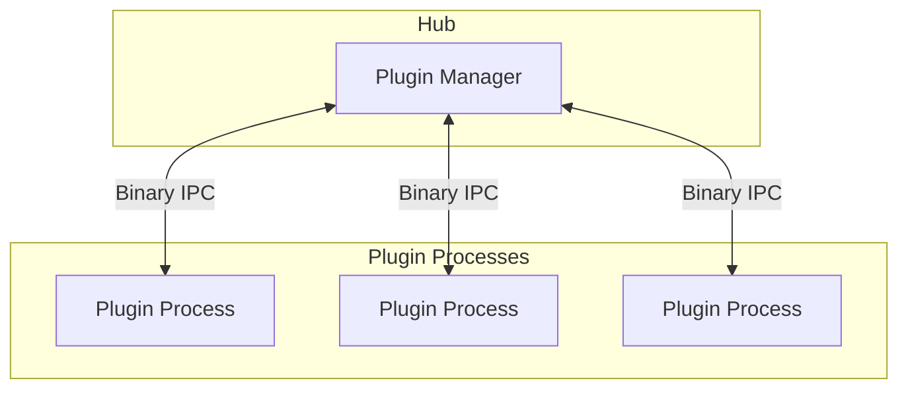

# Plugins Overview

Plugins are the building blocks of BRIKA. Each plugin runs in an isolated process and communicates with the hub via binary IPC.

## What is a Plugin?

A plugin is a Bun/Node.js package that:

* Defines **reactive blocks** for use in workflows
* Provides **bricks** — client-rendered dashboard UI components
* Runs in a **separate process** (isolated from the hub)
* Communicates via **binary IPC** (Inter-Process Communication)
* Has access to the **event bus** for pub/sub messaging

## Architecture



## Plugin Benefits

### Isolation

Each plugin runs in its own process:

* **Crash isolation** — One plugin crashing doesn't affect others
* **Memory isolation** — Plugins can't access each other's memory
* **Security** — Plugins are sandboxed from the hub

### Type Safety

The SDK provides full TypeScript support:

* **Zod schemas** for input/output validation
* **Type inference** for configuration
* **Compile-time checks** for block definitions

### Reactive Streams

Blocks use reactive programming:

* **Declarative data flow** — Define how data transforms
* **Automatic cleanup** — Subscriptions managed automatically
* **Composable operators** — map, filter, delay, debounce, etc.

## Plugin Structure

```
plugins/my-plugin/
├── package.json       # Plugin manifest with blocks and bricks metadata
├── src/
│   ├── index.tsx      # Entry point (server-side logic, data pushing)
│   ├── actions.ts     # Server-side actions (optional)
│   └── bricks/        # Client-rendered brick components (optional)
│       ├── compact.tsx
│       └── detail.tsx
├── locales/           # Translations (en + fr)
│   ├── en/
│   │   └── plugin.json
│   └── fr/
│       └── plugin.json
├── icon.svg           # Optional: Plugin icon
└── tsconfig.json
```

## ID Convention

BRIKA uses a consistent ID format:

| Type | Format | Example |
|------|--------|---------|
| Plugin ID | Package name | `@brika/plugin-timer` |
| Block ID | `pluginId:blockId` | `@brika/plugin-timer:countdown` |
| Brick ID | Local ID | `compact` |

## Next Steps

* [Create a Plugin](create-plugin.md) — Build your first plugin
* [Reactive Blocks](reactive-blocks.md) — Define blocks with inputs and outputs
* [Bricks](bricks.md) — Build client-rendered dashboard components
* [Lifecycle Hooks](lifecycle-hooks.md) — Handle plugin startup and shutdown
